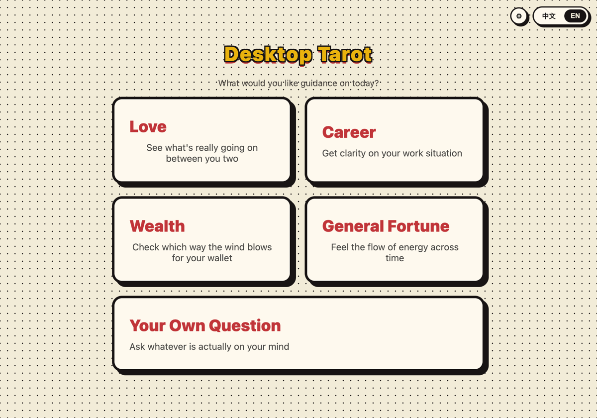

<div align="center">

# 🔮 Desktop Tarot · 桌面塔罗

**Read your own cards.** A comic-styled desktop tarot app — all 78 cards, fully offline, instant readings, optional AI.

*English · [简体中文](README.md)*


</div>

---

## What it is

Pick a topic (or write your own question), draw three cards by intuition from the full deck spread across the table, then flip them for a complete reading.

**Entirely offline, free, no sign-up.** The interpretations ship inside the app — it works with the network off.

<table>
<tr>
<td width="50%"></td>
<td width="50%"></td>
</tr>
<tr>
<td align="center"><sub>Five spreads, including your own question</sub></td>
<td align="center"><sub>The revealed spread, artwork uncropped</sub></td>
</tr>
</table>

Each card gives you more than a sentence: the reading itself, how that card wants to be read **in that particular position**, what the imagery is doing, and the blind spot to watch for.

<div align="center">

</div>

The summary **reads the shape of the spread first** — Major/Minor ratio, dominant suit, reversals, repeated numbers — then the cards in their positions, and closes on what the cards say to each other rather than on a stock line.

<div align="center">

</div>

## Features

- 🎴 **Full 78-card deck** — 22 Major + 56 Minor Arcana, classic Rider-Waite-Smith artwork, upright and reversed
- 📖 **Every card written individually** — all 78 reasoned from numerology, elemental attribution and what the RWS image actually shows, not filled in from a template
- 🔍 **Reads the spread's structure** — Major/Minor ratio, dominant suit, reversals and repeated numbers come first, before any single card
- 🗂️ **Five spreads** — Love, Career, Wealth, General Fortune, plus **your own question** (ask anything)
- 🌏 **Bilingual** — English and Simplified Chinese, with all 78 cards written in both
- 🔒 **Fully offline** — interpretations are bundled; nothing is uploaded, no account needed
- 🤖 **Optional AI reading** — add your own Anthropic API key and Claude will write an interpretation for your specific question (entirely optional)
- 🎨 **Comic-book UI** — heavy ink outlines, halftone texture, a wooden tabletop, flip animations

## Try it online

No install — draw a spread straight in the browser, phone included:

**[https://sashaqi.github.io/desktop-tarot-cards/](https://sashaqi.github.io/desktop-tarot-cards/)**

The web build ships the full local interpretations. **AI readings are desktop-only** — an API key should never be typed into a web page, where it would be exposed.

## Quick start

Requires Node.js 18+.

```bash
git clone https://github.com/sashaqi/desktop-tarot-cards.git
cd desktop-tarot-cards
npm install
npm run dev
```

Other scripts:

```bash
npm run build      # production build
npm run typecheck  # TypeScript type checking
```

## About AI readings (optional)

**The app is complete without this** — every spread has a full local interpretation, and custom questions are keyword-routed to the closest thematic tone.

To get a reading tailored to your specific question:

1. Get an API key from the [Anthropic Console](https://console.anthropic.com/)
2. ⚙ in the top-right corner → paste and save
3. After a reading, hit "AI Reading"

The key is encrypted with your OS keychain (Electron `safeStorage`) and stored locally. It is only ever read in the main process, is never exposed to the renderer, and never goes anywhere except the Anthropic API. The settings panel shows exactly where it lives on disk.

Uses Claude Haiku 4.5 — roughly 500 input + 300 output tokens per reading, so cost is negligible.

## How this was built

**The entire project was pair-built with [Claude](https://claude.ai/code), including this README.** It went through three versions, and the git history shows the whole thing:

| Version | What changed |
|---|---|
| **v1** | Core flow working: 22 Major Arcana, three spreads, flip animation |
| **v2** | Full 78-card deck, bilingual UI, Wealth spread, tightened layout throughout |
| **v3** | Custom questions with keyword routing, optional AI readings, uncropped card faces |
| **v4** | All 78 readings rewritten, spread-structure analysis, position lens, AI prompt rebuilt around how a reader actually works |

A few moments worth calling out:

- **All 78 card interpretations were written by the AI** — 780 passages in total (78 cards × meaning upright/reversed, imagery, and cautions upright/reversed × two languages). I didn't edit a single line.
- **In v4 it flagged its own shortcut.** The Minor Arcana had originally been generated from suit themes crossed with rank templates, so same-numbered cards across suits were the same sentence with the nouns swapped. It raised that, then rewrote all 56 individually.
- **The card-picking backdrop went from green felt to wood** because I said the green wasn't making the cards pop. It diagnosed the actual cause — the deep-blue card backs and the green felt sat too close in both value and saturation — and offered three alternatives to choose from.
- **The AI feature almost shipped differently.** I wanted to wire an LLM in directly; it argued for a local fallback first with AI as an optional upgrade, on the grounds that offline availability matters more for a tool like this.

## Tech stack

Electron + React + TypeScript, built with [electron-vite](https://electron-vite.org/). No external state library in the renderer — one `useReducer` plus Context covers it.

## Data sources & license

Card scans and the name/suit metadata come from [equokka/tarot-json](https://github.com/equokka/tarot-json) (MIT License); the original Rider-Waite-Smith artwork is public domain in the US.

**All interpretation text was written for this project** — nothing was copied from books or websites.

Released under the [MIT License](LICENSE).

---

<div align="center">
<sub>Tarot is a mirror, not a prophecy. What matters isn't the card — it's what the card made you think about.</sub>
</div>
