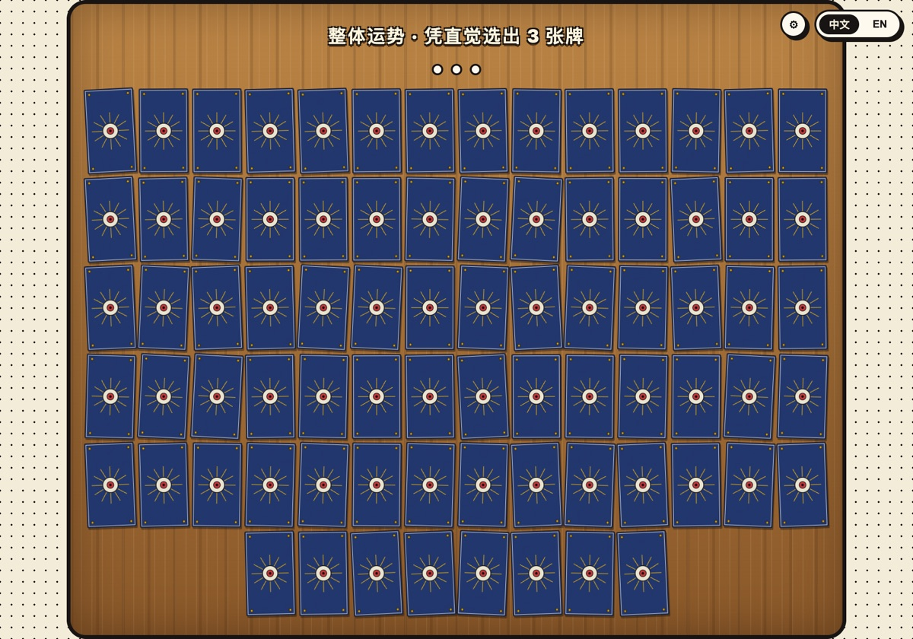
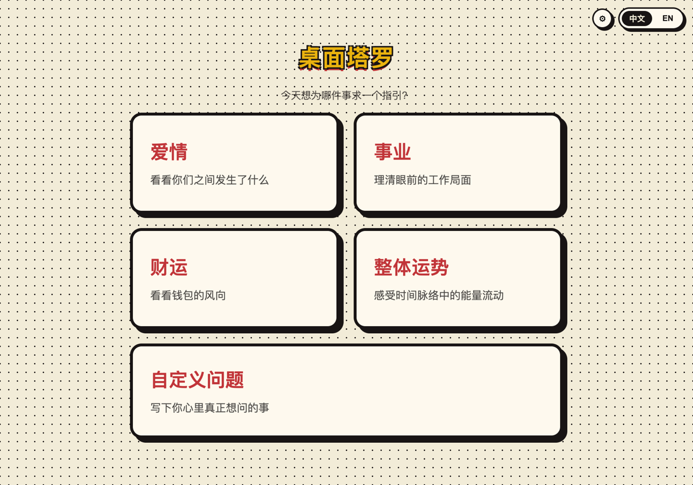
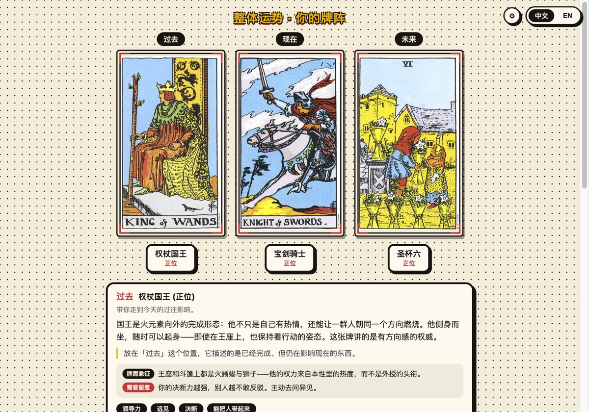
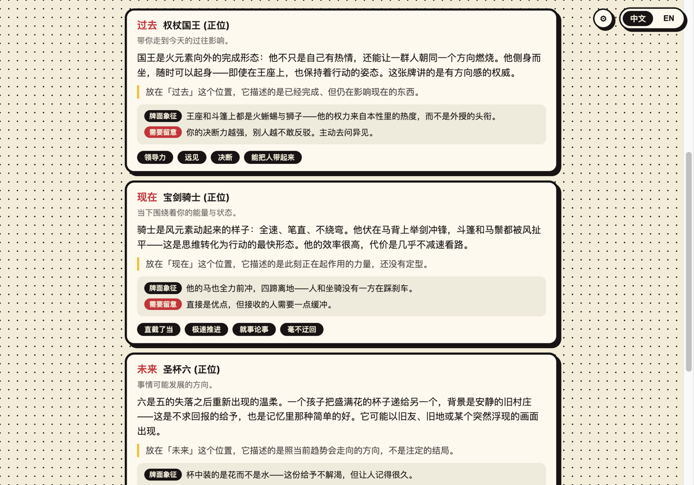
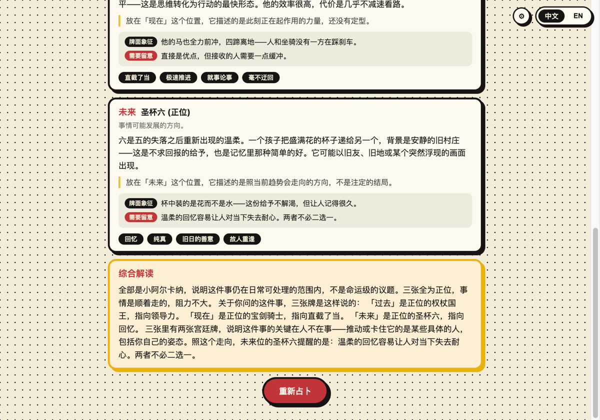

<div align="center">

# 🔮 桌面塔罗 · Desktop Tarot

**占卜不求人** —— 一个漫画风格的桌面塔罗应用，78 张牌全部离线可用，即时出解读，可接入 AI。

*[English](README.en.md) · 简体中文*




</div>

---

## 这是什么

选一个主题（或者写下你自己的问题），从铺满桌面的 78 张牌里凭直觉点选 3 张，翻开后得到一份完整的解读。

**全程离线、零成本、不用注册。** 牌意库内置在应用里，没有网络也能用。

<table>
<tr>
<td width="50%"></td>
<td width="50%"></td>
</tr>
<tr>
<td align="center"><sub>五个主题，含自定义问题</sub></td>
<td align="center"><sub>翻牌后的牌阵，牌面完整露出</sub></td>
</tr>
</table>

每张牌给出的不只是一句话：牌意本身、这张牌**放在这个位置**该怎么读、牌面象征、以及需要留意的盲点。

<div align="center">

</div>

综合解读会**先读牌阵的整体格局**（大牌占比、主导花色、正逆位分布、重复数字），再逐位解读，最后从牌与牌的关系里给出收尾——而不是套用一句通用建议。

<div align="center">

</div>

## 特性

- 🎴 **完整 78 张牌** —— 22 张大阿尔卡纳 + 56 张小阿尔卡纳，经典 Rider-Waite-Smith 牌面，支持正逆位
- 📖 **逐张手写的牌意** —— 78 张牌全部独立撰写，依据数字学、元素属性和 RWS 实际画面推导，不是模板套用
- 🔍 **会读牌阵结构** —— 先看大牌占比、主导花色、正逆位分布和重复数字，再解读单张牌
- 🗂️ **五种牌阵** —— 爱情、事业、财运、整体运势，外加**自定义问题**（可以问任何事）
- 🌏 **中英双语** —— 一键切换，78 张牌的解读文案两种语言都有
- 🔒 **完全离线** —— 牌意库内置，不联网、不上传、不需要账号
- 🤖 **可选 AI 解读** —— 填入自己的 Anthropic API Key 后，可以让 Claude 针对你的具体问题写一份解读（不填也能完整使用）
- 🎨 **漫画风界面** —— 粗描边、网点纹理、木纹桌布、翻牌动画

## 在线体验

不用安装，打开就能抽牌（手机也可以）：

- **[https://sashaqi.github.io/desktop-tarot-cards/](https://sashaqi.github.io/desktop-tarot-cards/)**
- 国内访问建议用 Cloudflare 镜像（GitHub Pages 在国内偶尔较慢）

网页版的牌意解读是完整的。**AI 深度解读只在桌面版提供**——API Key 不应该填进网页，那等于公开泄露。

## 快速开始

需要 Node.js 18+。

```bash
git clone https://github.com/sashaqi/desktop-tarot-cards.git
cd desktop-tarot-cards
npm install
npm run dev
```

其他脚本：

```bash
npm run build      # 构建生产包
npm run typecheck  # TypeScript 类型检查
```

## 关于 AI 解读（可选）

**不配置也能完整使用** —— 所有主题都有完整的本地解读。自定义问题会通过关键词路由匹配到最贴切的牌阵语气。

想要针对具体问题的解读：

1. 到 [Anthropic Console](https://console.anthropic.com/) 申请 API Key
2. 应用右上角 ⚙ → 填入并保存
3. 占卜结束后点「AI 深度解读」

Key 用系统钥匙串（Electron `safeStorage`）加密后存在本地，只在主进程使用，渲染进程拿不到，也不会上传到 Anthropic API 以外的任何地方。设置面板里会显示具体的保存路径。

模型用的是 Claude Haiku 4.5，单次占卜约 500 输入 + 300 输出 token，成本可以忽略。

## 这个项目是怎么做出来的

**整个项目由 [Claude](https://claude.ai/code) 结对完成，包括这份 README。** 迭代了三个版本，git history 里能看到完整过程：

| 版本 | 主要变化 |
|---|---|
| **v1** | 跑通核心流程：22 张大阿尔卡纳 + 三主题牌阵 + 翻牌动画 |
| **v2** | 扩展到完整 78 张牌、中英双语、新增财运牌阵、界面全面收紧 |
| **v3** | 自定义问题 + 关键词路由、可选 AI 解读、牌面完整展示 |
| **v4** | 78 张牌意逐张重写、牌阵结构分析、位置透镜、AI prompt 按真人读牌逻辑重构 |

几个我觉得值得一提的片段：

- **78 张牌的解读文案全部由 AI 撰写**，中英双语共 780 段（78 张 × 牌意正逆位、牌面象征、留意事项正逆位 × 两种语言），我一句都没改
- **v4 时它自己指出了自己的偷懒**：小阿尔卡纳最初是「花色主题 × 数字主题」的模板生成的，同数字的四张牌只换了名词。它把这个问题摆出来，然后把 56 张牌逐张重写了一遍
- **选牌背景从绿色台呢改成木纹桌面**，是因为我说「绿色不太突出牌背」，它诊断出问题在于深蓝卡背和绿呢的明度与饱和度太接近，然后给了三个对比方案让我选
- **AI 解读功能差点没做成现在这样** —— 我本来想直接接大模型，它建议先做本地兜底再把 AI 做成可选增强，理由是离线可用性对这类工具更重要

## 技术栈

Electron + React + TypeScript，用 [electron-vite](https://electron-vite.org/) 构建。渲染层无外部状态管理库，一个 `useReducer` + Context 就够了。

## 数据来源与许可

卡牌图与名称/花色元数据来自 [equokka/tarot-json](https://github.com/equokka/tarot-json)（MIT License）；原始 Rider-Waite-Smith 牌面在美国属于公有领域。

**牌意解读文案为本项目原创编写**，未照搬任何书籍或网站。

本项目以 [MIT License](LICENSE) 开源。

---

<div align="center">
<sub>塔罗是一面镜子，不是预言。抽到什么牌，重要的是它让你想到了什么。</sub>
</div>
